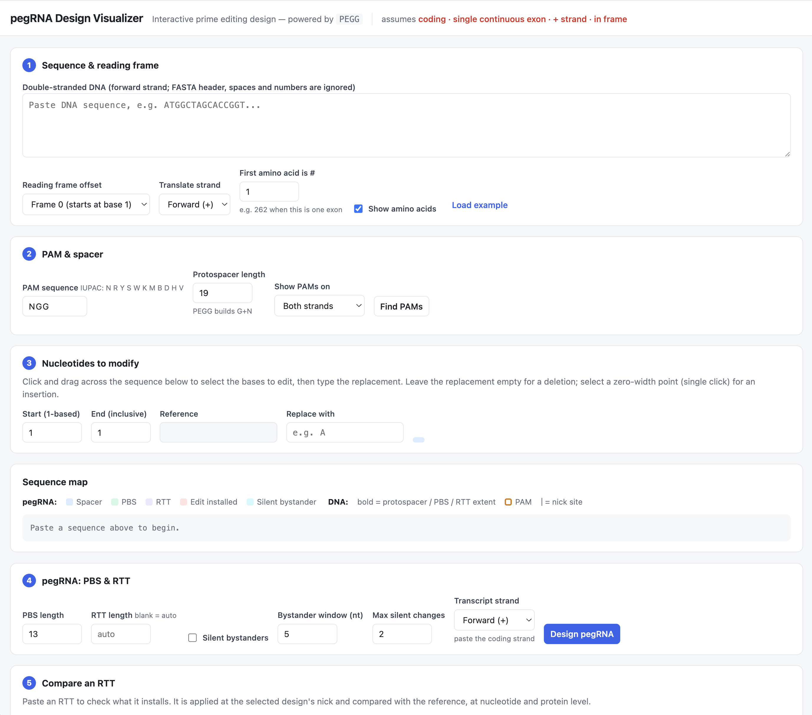
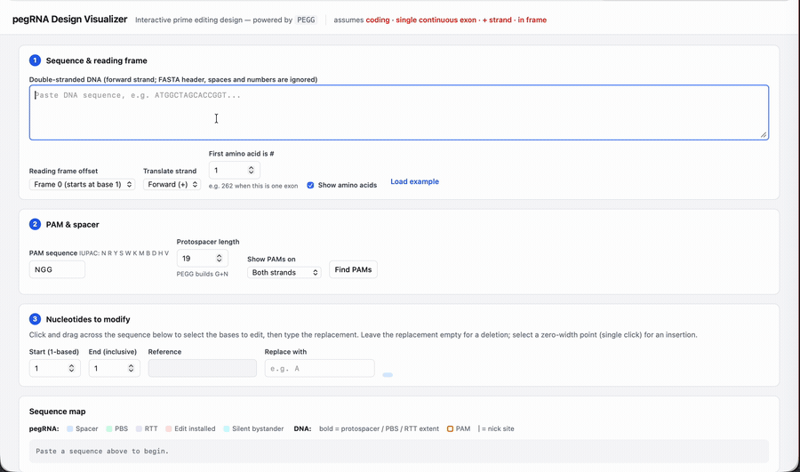
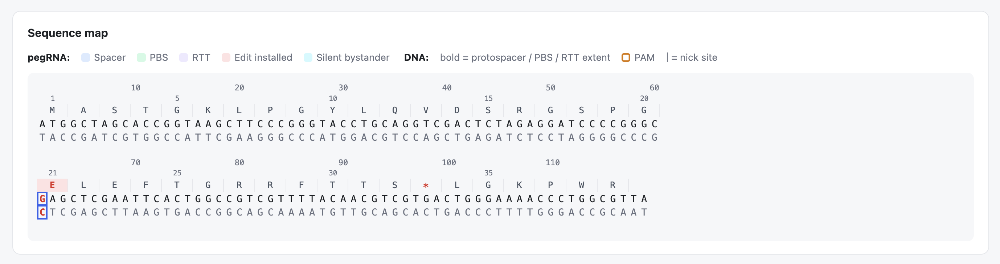
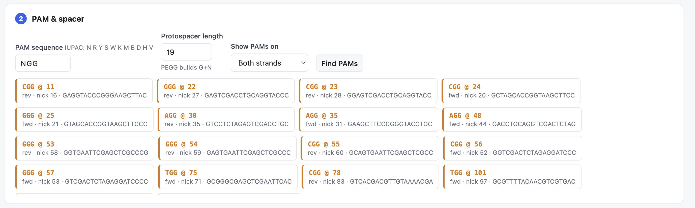
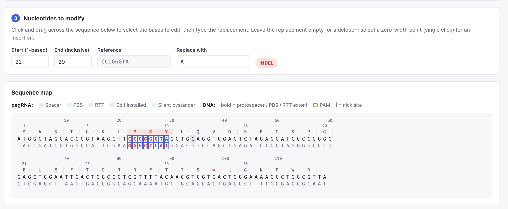
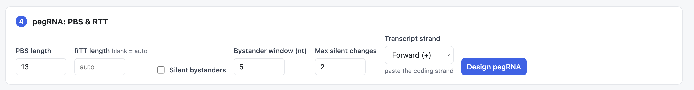
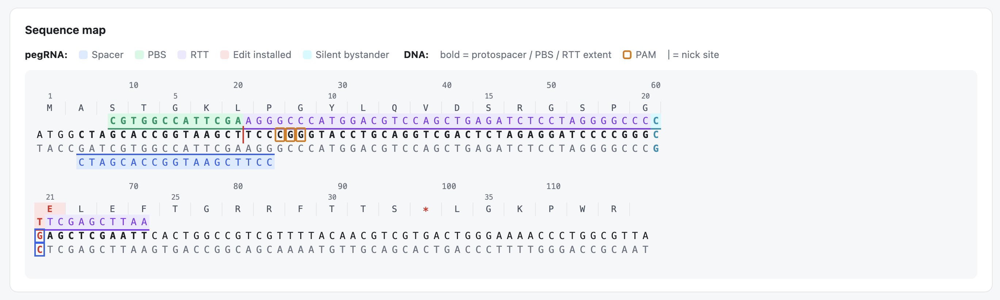
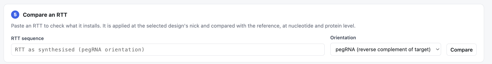

# pegRNA Design Visualizer — User Guide

An interactive web tool for designing and inspecting prime editing guide RNAs
one locus at a time.

It is a front end for **[PEGG 3](https://github.com/kexindon/PEGG3.0)**: the
protospacer search, PBS/RTT construction, variant classification and silent
bystander enumeration are all PEGG's, and PEGG 3 specifically, because silent
bystanders live in `pegg.bystander`, which earlier releases do not have. Where
PEGG designs thousands of pegRNAs from a mutation table, this tool shows you
*one* design in full — every base drawn in place, so you can see what the RTT
actually installs before committing to a library.

---

## Requirements

PEGG needs **Python 3.9 or 3.10**. Its on-target scoring models are pickled
with scikit-learn 1.1.1, which does not build on newer Pythons.

## Install and run

```bash
conda create -n pegg python=3.9 -y
conda activate pegg
pip install -r requirements.txt
python run.py
```

Open <http://127.0.0.1:5050>.

Port 5050 rather than Flask's usual 5000, which macOS occupies with its AirPlay
Receiver. Override with `PORT`, or use `HOST=0.0.0.0` to let others on your
network reach it.

Coming back later, or picking up a new PEGG release:

```bash
conda activate pegg
pip install --upgrade --upgrade-strategy only-if-needed pegg
python run.py
```

`--upgrade-strategy only-if-needed` matters: the default strategy also upgrades
dependencies, and numpy 2 breaks cyvcf2's compiled parts.

Visit `/api/health` to confirm which copy of PEGG is actually in use.



---

## What to paste

The tool searches for PAMs and builds the RTT **inside the string you paste**,
so that string has to be real genomic DNA — not a transcript. Two consequences:

- **One exon at a time.** An RTT is one contiguous stretch of genome and cannot
  cross an intron. Pasting a spliced transcript would let the tool place
  bystanders across a splice junction, where they do not exist.
- **In frame.** Trim to whole codons so the translation is right.

`cds_for_visualizer.ipynb` does both for you: give it a gene and a coding
mutation, and it returns the exon containing it, trimmed to codon boundaries,
on the coding strand, along with the position to select and the first amino
acid number.

---

## Walkthrough



<!-- The same recording as an mp4 (smaller, seekable) is docs/media/walkthrough.mov.
     To show it as an inline player instead of this GIF: drag the file into a new
     GitHub issue comment without submitting it, then paste the
     user-images.githubusercontent.com URL GitHub returns on its own line. A
     <video> tag will not work -- GitHub strips it from Markdown. -->

The panels are numbered in the order you use them. **Load example** fills in a
short synthetic sequence with an edit already selected, so you can click
through all six steps before bringing your own data.

### 1. Sequence & reading frame

Paste the DNA. FASTA headers, whitespace and numbering are stripped.

Set **Reading frame offset** (0/1/2) and **Translate strand** so the protein
reads correctly — for a `-` strand gene you paste the genomic `+` strand and
translate the reverse complement.

Set **First amino acid is #** when the sequence is a fragment. An exon starting
at G262 reports the edit as `R273C` rather than `R12C`.



### 2. PAM & spacer

Enter a PAM (any IUPAC string — `NGG`, `NG`, `NNGRRT`) and the protospacer
length, choose which strands to search, then **Find PAMs**. Click a hit to
select it; its nick site anchors everything downstream.



### 3. Nucleotides to modify

Drag across the sequence map to select bases, then type the replacement.
Substitutions, insertions (zero-width selection), deletions (empty
replacement) and indels all work; PEGG classifies the variant type.



### 4. pegRNA

Set **PBS length** and **RTT length**, then **Design pegRNA**. You get the
protospacer, PBS, RTT, 3′ extension and the full pegRNA, plus the distance to
the nick, the right homology arm, and whether the edit disrupts the PAM or the
protospacer — all drawn onto the map in place.



### 5. Silent bystanders

Set a **Bystander window** and **Max silent changes** to add synonymous
mutations near the edit — they evade mismatch repair, and knock out the PAM
when they land in it.

Every option is verified synonymous against the reading frame you declared in
step 1, and listed with its base change, mutation count, distance to the edit
and whether it kills the PAM. Selecting one highlights it on the map.

This is why the frame settings in step 1 matter: a wrong frame makes every
"silent" change a lie.



### 6. RTT comparison

Paste any RTT — or send one over from a design — to see exactly what it
installs: the edited sequence, the nucleotide differences, and the resulting
protein against the reference. Useful for checking an RTT someone else designed,
or one from a PEGG library.



---

## Limitations

- **Coding variants, one exon, in frame.** The reading frame is whatever you
  declare; the tool cannot check it against an annotation.
- **No splice site awareness.** It sees only the string you paste.
- **Not a library designer.** For thousands of pegRNAs, use PEGG directly.

See the [README](https://github.com/kexindon/prime-editing-visualization#readme) for the API, correctness notes, and details on generating
input sequences.
